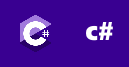

# 

🎓 Estudante de **Ciência da Computação** na [UFCA](https://www.ufca.edu.br/)  
💻 Desenvolvedor **Fullstack** apaixonado por tecnologia e aprendizado contínuo!

## 🌱 Sobre Mim

- 🚀 Atualmente aprendendo **[C#]**.
- 💡 Sempre buscando criar projetos inovadores que resolvam problemas reais.
- 🌍 No meu tempo livre, gosto de explorar o mundo dos games e aprender algo novo!

## Linguagens usadas

